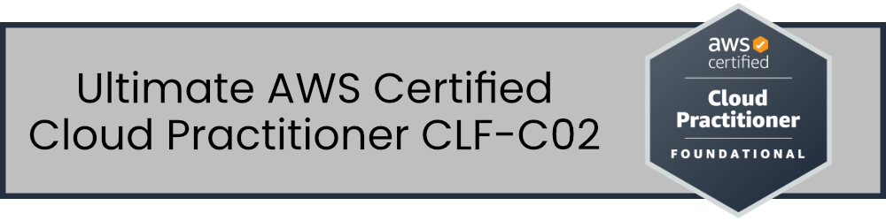

<!--
### Ultimate AWS Certified Cloud Practitioner CLF-C02
-->
### Section 01 - Introduction

###### Course Introduction
**Course**: [[NEW] Ultimate AWS Certified Cloud Practitioner CLF-C02](https://www.udemy.com/course/aws-certified-cloud-practitioner-new/)  
**Author**: Stephane Maarek  
- [Website](https://www.stephanemaarek.com/)  
- [LinkedIn](https://www.linkedin.com/in/stephanemaarek)  
- [Instagram](https://Instagram.com/stephanemaarek)  
- [Medium](https://medium.com/@stephane.maarek)  
- [Twitter](https://twitter.com/stephanemaarek)  
- [GitHub](https://github.com/simplesteph)

**Details**: Sections • 283 lectures • 14h 55m total length

Sample Exam Questions [
Exam Prep Official Question Set: AWS Certified Cloud Practitioner (CLF-C02 - English)](https://explore.skillbuilder.aws/learn/course/external/view/elearning/14050/aws-certified-cloud-practioner-official-practice-question-set-clf-c02-english)

Other (old?) [Sample Example Questions](https://d1.awsstatic.com/training-and-certification/docs-cloud-practitioner/AWS-Certified-Cloud-Practitioner_Sample-Questions.pdf)

### Terms
AMI - Amazon Machine Images  
AWS - Amazon Web Services  
AZ - Availability Zone  
BYOL – Bring Your Own License  
CAPEX - Capital Expenses  
CCP - Contact Control Panel  
CLI - Command Line Interface  
EBS - Elastic Block Store  
EC2 - Elastic Compute Cloud or Infrastructure as a Service  
EFS - Elastic File System  
EFS-IA - Elastic File System Infrequent Access  
FSx - File Systems x or any backup, Windows or Lusture  
FTP - File Transfer Protocol  
IAM - Identity & Access Management  
IOPS - Input/Output Operations per Second  
MFA - Multi-Factor Authentication  
NFS - Network File System  
OPEX - Operational Expenses  
RDP - Remote Desktop Protocol  
SDK - Software Development Kit  
SFTP - Secure File Transfer Protocol  
SSH - Secure Shell (Protocol)  

### Resources

[Roadmap - AWS](https://roadmap.sh/aws)
